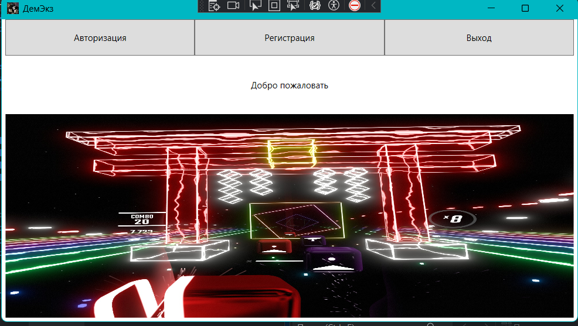
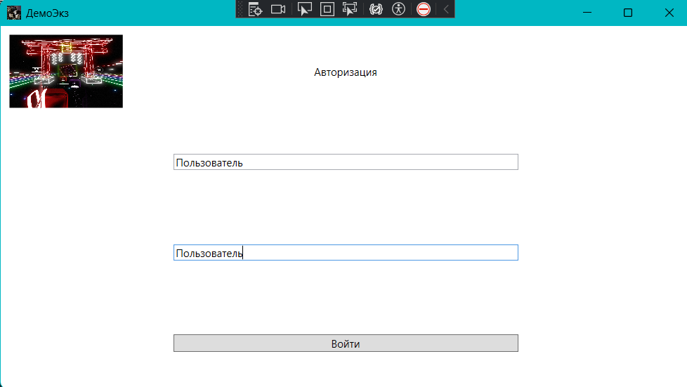
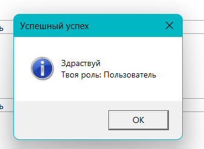
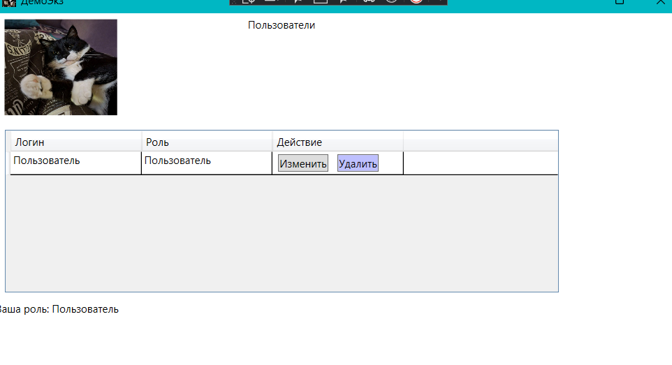
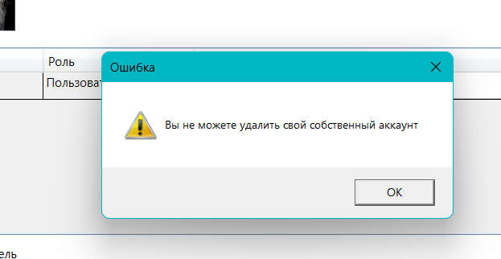
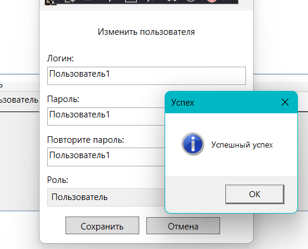

# Итоговое задание
## Описание:
Проект создан при выполнении подготовки к дем. экзамену для выполнения итогового задания.
В проекте осуществляется авторизация пользователей под разными ролями, работа с ограничением ролей, и базой данных.
## Структура проекта:
_______________
## Руководство пользователя

Запустите программу.

Нажмите на кнопку авторизация и введите данные в открывшемся окне.

Нажмите кнопку войти.

Еще раз нажмите на кнопку входа в следующем открывшемся окне.

При нажатии кнопки удалить, пользователь не будет удален так как нельзя удалить самого себя.

При нажатии на кнопку изменить откроется окно редактирования в котором пользователь
 может изменить свой логин и пароль.

## Лицензия
________________
## Автор
Дегтерева Алла (bonny2155-dotcom)
